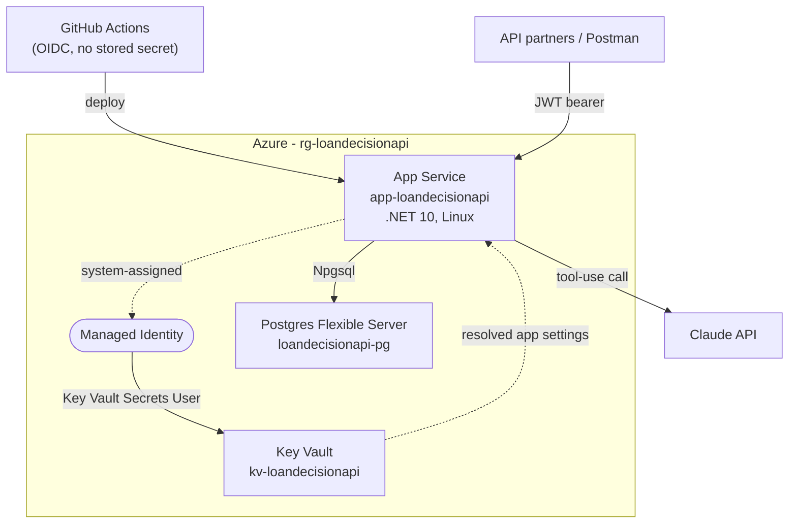

# LoanDecisionApi

LoanDecisionApi models a loan-decisioning process at a small, sample scale — the way a real lending workflow moves an application from intake to decision. The standout piece is its AI integration: rather than requiring every caller to send a rigid, pre-structured payload, the evaluation step hands free-text data straight to **Claude (Anthropic's AI model)**, which interprets it into clean, validated fields the rest of the system can trust. The API is deployed on Azure with a full CI/CD pipeline, managed secrets, and a managed database.

## What it does

A partner submits a loan application and it gets a fast, automated pre-screen based on credit score and how much is being requested relative to income. From there, a second evaluation pass accepts a free-text credit profile — a pay stub, a credit report, whatever the source document looks like — and Claude extracts the relevant facts into validated fields instead of loose text. Those facts run through a configurable rule engine (nested AND/OR groups, not a flat checklist) to land on Approved, Denied, or Pending Review.

## Architecture decisions worth noting

- **Nullable over sentinel, deliberately.** Fields like `MonthlyDebtPayments` or `IsIdentityVerified` default to `null`, not `0`/`false`, specifically because those default values are also legitimate real data (debt-free applicants exist; a fraud check that hasn't run yet is not the same as one that came back clean). The rule engine's `Skipped` outcome and three-valued (Kleene) AND/OR logic exist so "not yet known" never gets silently coerced into a pass or a fail.
- **AI output is schema-constrained, not hoped-for.** The evaluation endpoint accepts free text and calls Claude's Messages API using tool use with a JSON Schema matching the existing validated DTO shape, rather than asking the model to "return JSON" in a prompt and parsing whatever comes back. The parsed result flows through the exact same validator every other caller of that DTO uses.
- **Secrets never touch source control or committed config**, locally or in the cloud — `dotnet user-secrets` during development, Azure Key Vault (via managed identity, no stored credential) once deployed.
- **CI/CD authenticates to Azure with zero stored secrets**, via GitHub OIDC / workload identity federation — a short-lived token proving "this run is from this exact repo and branch" is exchanged directly for Azure access, with nothing long-lived sitting in a GitHub secret to leak.

## Tech stack

ASP.NET Core (.NET 10) · EF Core + Npgsql (PostgreSQL) · JWT bearer auth · ASP.NET Core Data Protection (SSN encryption at rest) · Claude API (tool use / structured output) · xUnit + Shouldly

## Testing

Unit tests (xUnit + Shouldly) cover the domain layer that carries the most risk of a subtle bug: the rule engine's three-valued AND/OR logic, the shared validator rules, and the `Result<T>` success/failure pattern. Tests are a CI gate, not just documentation — `.github/workflows/deploy.yml` runs the full suite on every push to `main`, and a failing test blocks the deployment step entirely.

```
dotnet test
```

## Deployed architecture (Azure)



- **App Service** runs the published API. Application settings for the JWT signing key/issuer/audience, the Anthropic API key, and the Postgres connection string are all [Key Vault references](https://learn.microsoft.com/azure/app-service/app-service-key-vault-references) (`@Microsoft.KeyVault(SecretUri=...)`) rather than plain values — resolved at runtime via the app's system-assigned managed identity, which holds only the narrow `Key Vault Secrets User` role scoped to the vault itself.
- **Key Vault** holds every secret the app needs. Nothing is duplicated into App Service's own settings in plaintext.
- **Postgres Flexible Server** is the managed database, firewalled to Azure services plus the specific IPs that need direct access.
- **GitHub Actions** (`.github/workflows/deploy.yml`) runs the test suite, publishes, and deploys on every push to `main`, authenticating via a federated credential trust (`AADSTS`-verified OIDC token exchange) — the deploying identity holds `Website Contributor` scoped to just this one App Service resource, not the resource group.

## Running locally

```
dotnet user-secrets set "ConnectionStrings:LoanDecisionDb" "<your local Postgres connection string>"
dotnet user-secrets set "Jwt:SigningKey" "<base64 key>"
dotnet user-secrets set "Jwt:Issuer" "LoanDecisionApi"
dotnet user-secrets set "Jwt:Audience" "LoanDecisionApi.Partners"
dotnet user-secrets set "Anthropic:ApiKey" "<your key>"
dotnet ef database update
dotnet run --launch-profile http
```

A test `ApiPartner` is seeded automatically on startup in the `Development` environment.
